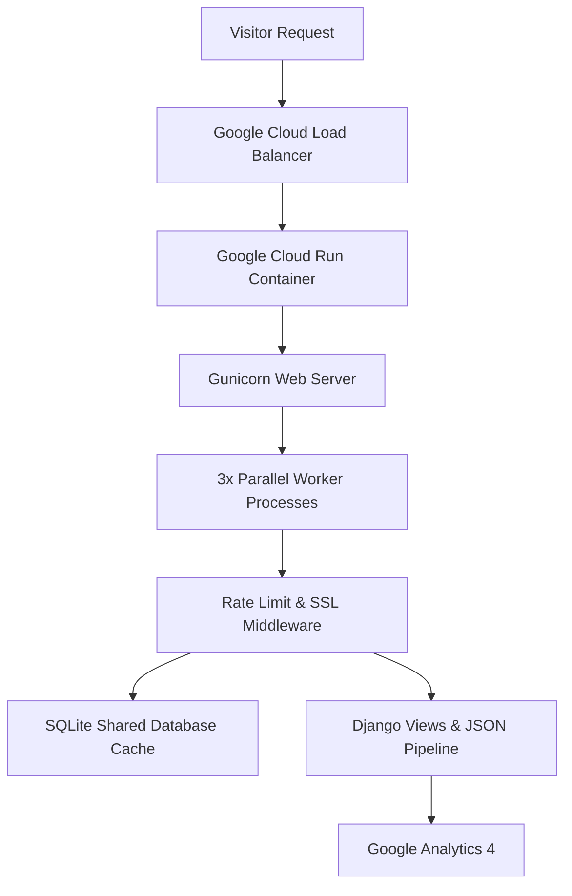

# Hackerproof Personal Portfolio Website (GCP Cloud Run)

A secure, stateless, and fully optimized personal portfolio website built with Django and Python, designed for serverless container deployment on Google Cloud Platform (GCP).

## 🚀 Key Features

*   **Stateless Serverless Architecture:** Fully optimized for seamless containerized execution on **Google Cloud Run (GCP)** with zero monthly subscription or idle running costs.
*   **Comprehensive Application Defense (Layer 7):**
    *   IP-level rate limiting using `django-ratelimit` (strict **5 requests/minute** for form POSTs, **30-40 requests/minute** for page views).
    *   Proxy-aware client IP extraction resolving real visitor IPs from Google Cloud Load Balancer's `X-Forwarded-For` header.
    *   Hidden form honeypots to silently discard automated bot spam submissions.
*   **Centralized Multi-Process Cache:** Uses Django's `DatabaseCache` backend stored in a shared SQLite database (`django_cache_table`), which is automatically created on container startup in the Dockerfile. This perfectly synchronizes rate-limiting states across all **3 parallel Gunicorn worker processes** inside the container.
*   **Premium Glassmorphic 429 UI:** Served on rate-limit blocks with an animated shield icon and an interactive **client-side JavaScript countdown timer** that automatically unlocks navigation when the 60-second cooldown expires.
*   **Dynamic Portfolio Pipeline:** Reads projects and skills dynamically from a lightweight JSON pipeline (`portfolio_data.json`), with smart conditional logic to completely omit source code or live demo links for **private repositories**.
*   **Optimized Performance & SEO:** Uses `django-compressor` and Whitenoise for asset minification and static files compression, with clean sitemap URLs and optimized Google Analytics 4 tracking.

---

## 🏗️ Architecture



---

## 🛠️ Tech Stack

*   **Framework:** Django (Python)
*   **Server:** Gunicorn (WSGI)
*   **Deployment:** Google Cloud Run (Serverless Docker Container)
*   **Asset Management:** django-compressor + Whitenoise
*   **Database & Cache:** SQLite3 (DatabaseCache)
*   **Analytics:** Google Analytics 4 (gtag.js)

---

## 📦 Container Setup & Deployment

The site is packaged using a highly optimized Python Docker container:

```dockerfile
# Collect static files & compile assets
RUN python manage.py collectstatic --noinput && python manage.py compress

# Container Entrypoint (Automates Migrations and Cache Table Setup)
CMD ["sh", "-c", "python manage.py migrate && python manage.py createcachetable && gunicorn --bind 0.0.0.0:8080 --workers 3 --threads 2 --timeout 60 mainweb.wsgi:application"]
```

Deploying updates is completely automated via GitHub Actions on every push to the `main` branch.
